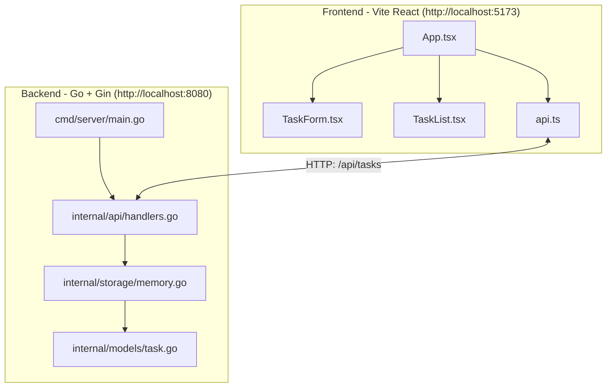

# Azure Tasks App: Full-Stack Cloud-Native Project

**Goal:** Build a simple but real **Task Manager** to learn modern full-stack development and Azure deployment end-to-end.

* **Frontend:** React + TypeScript (SPA, scaffolded with **Vite**)
* **Backend:** Go (Gin web framework)
* **Database:** Azure Cosmos DB (MongoDB API)
* **Containers:** Docker Desktop (**personal**) or Podman (**corporate**)
* **Cloud:** Azure Container Apps (images in Azure Container Registry)
* **CI/CD:** GitHub Actions
* **Future-ready:** Easily move backend to AKS later

> This guide assumes no prior knowledge. Every step explains **what we’re doing** and **why we’re doing it** this way.

---

## Overview

You’ll build two separate apps:

* A **frontend** Single Page Application (SPA) in React + TypeScript (served locally by Vite).
* A **backend** HTTP API in Go (Gin), starting with **in-memory** storage. Later you’ll switch to **Cosmos DB** without changing the handlers.

The browser calls the API over HTTP. During development they run on different ports, so we enable **CORS** on the API to allow the browser to call it.

---

## Phase Breakdown

1. **Prerequisites & Setup**
   Install tools and create the repo layout.

2. **Frontend: React + TypeScript (Vite)**
   Scaffold, clean up, implement in-memory Task UI, refactor into components.

3. **Backend: Go API (Gin)**
   Scaffold, implement CRUD with an in-memory store, enable CORS, test with PowerShell.

4. **Database: Cosmos DB (MongoDB API)**
   Deploy Cosmos DB, use the MongoDB Go driver, and swap the memory store for DB persistence.

5. **Dockerization**
   Write Dockerfiles for backend & frontend (and optionally Compose) and run locally in containers.

6. **Azure Deployment**
   Push images to ACR and deploy to Azure Container Apps; store secrets safely.

7. **CI/CD with GitHub Actions**
   Build, push, and deploy automatically on push.

8. **Monitoring & Scaling (Optional/Future)**
   Azure Monitor/App Insights; plan for AKS migration.

> Estimated total time: **18–28 hours** (learning-by-doing pace).

---

## Technology Stack Summary

| Layer      | Choice                    | Why                                 | Azure Integration                 |
| ---------- | ------------------------- | ----------------------------------- | --------------------------------- |
| Frontend   | React + TypeScript (Vite) | Popular, fast dev server, TS safety | Static Web Apps or Container Apps |
| Backend    | Go (Gin or Echo)          | Fast, simple, ideal for APIs        | ACA now; easy AKS later           |
| Database   | Cosmos DB (MongoDB API)   | Managed NoSQL, elastic scale        | Azure Cosmos DB                   |
| Containers | Docker / Podman           | Portable, reproducible              | ACR + ACA                         |
| CI/CD      | GitHub Actions            | First-class GitHub integration      | Azure Login & deploy actions      |
| Secrets    | ACA secrets / Key Vault   | Secure configuration                | Native Azure integration          |

---

## Architecture Diagram (dev)



---

## Estimated Time Per Phase

| Phase                 | Estimate      |
| --------------------- | ------------- |
| Prereqs & Setup       | 1–2 hrs       |
| Frontend (React)      | 3–5 hrs       |
| Backend (Go)          | 4–6 hrs       |
| Cosmos DB Integration | 3–5 hrs       |
| Dockerization         | 2–3 hrs       |
| Azure Deployment      | 3–4 hrs       |
| CI/CD Automation      | 2–3 hrs       |
| **Total**             | **18–28 hrs** |

*(Assumes you pause to understand each piece.)*

---

## Step-by-Step Guide

### Phase 1: Prerequisites & Project Initialization

**Why this step:** We need the toolchain that builds, runs, and deploys our apps.

#### Accounts

* Azure account (portal.azure.com)
* GitHub account (for repo + Actions)

#### Install Tools

##### Node.js (LTS)

**Why:** React tooling (Vite, npm) runs on Node.

* **Winget (recommended):**

  ```powershell
  winget install OpenJS.NodeJS.LTS -s winget
  node -v
  npm -v
  ```

* **Upgrade later (if needed):**

  ```powershell
  winget upgrade OpenJS.NodeJS.LTS -s winget
  ```

##### Go (latest)

**Why:** We’ll write the backend API in Go.

```powershell
winget install GoLang.Go
go version
```

##### Windows Subsystem for Linux (WSL) 2 (for container backends on Windows)

**Why:** Docker Desktop/Podman use WSL2 on Windows.

```powershell
wsl --list --verbose   # check
# If needed:
wsl --install
```

##### Docker Desktop (personal laptop)

**Why:** Easiest developer experience if licensing allows.

```powershell
winget install -e --id Docker.DockerDesktop
docker --version
docker run hello-world
```

##### Podman (corporate laptop)

**Why:** License-friendly alternative to Docker Desktop; runs a small VM (“podman machine”) with WSL2.

```powershell
winget install -e --id RedHat.Podman
podman --version

# Initialize VM once
podman machine init --cpus 2 --memory 2048 --disk-size 20 --now
podman machine start
podman info
podman run --rm hello-world
```

**Behind Zscaler/proxy?** Route image pulls via proxy:

```powershell
$env:HTTP_PROXY="http://proxy.mycorp.com:8080"
$env:HTTPS_PROXY="http://proxy.mycorp.com:8080"
$env:NO_PROXY="127.0.0.1,localhost"
podman machine stop
podman machine start
```

##### Azure CLI

**Why:** To deploy to Azure.

```powershell
winget install --id Microsoft.AzureCLI -e
az --version
# later:
az upgrade
```

##### VS Code & Git

Standard editor and version control.

#### Project Structure

**Why this layout:** Clear separation of concerns; idiomatic Go layout for long-term maintainability.

```
/azure-tasks-app
  /frontend                  # React app
  /backend                   # Go API
    /cmd/server/main.go      # entrypoint
    /internal/api/handlers.go# HTTP handlers
    /internal/models/task.go # domain structs
    /internal/storage/memory.go # in-memory store (swap later)
```

Initialize Git & remote as usual.

---

### Phase 2: Frontend — React + TypeScript (Vite)

**Why Vite:** CRA is deprecated; Vite is fast, modern, and minimal.

#### 2.1 Scaffold React app with Vite

**What:** Generate a working React+TS project quickly (scaffolding).

```bash
cd frontend
npm create vite@latest . -- --template react-ts
npm install
npm run dev   # http://localhost:5173
```

#### 2.2 Clean up starter files

**Why:** Remove demo logos and start fresh.

* Edit `src/App.tsx` (replace demo content with a minimal Task UI).
* Optionally, remove unused assets (e.g., `src/assets/react.svg`).
* Tweak `src/App.css` or keep minimal styles.

#### 2.3 Implement in-memory Task UI

**Why:** Quick UI to test UX before the API exists.

* Add tasks, list tasks, toggle completion, delete tasks — all in React state.

#### 2.4 Refactor into components (best practice)

**Why:** Smaller, testable, and reusable UI blocks.

```
src/
  App.tsx
  types.ts
  components/
    TaskForm.tsx   # emits onAdd(description)
    TaskList.tsx   # emits onToggle(id), onDelete(id)
```

> **Note:** When you clone onto another machine, run `cd frontend && npm install` (node_modules is not in Git).

---

### Phase 3: Backend — Go API (Gin)

**Why Gin:** Simple, popular, and great for small APIs.

#### 3.1 Scaffold Go project and dependencies

```powershell
mkdir backend\cmd\server, backend\internal\api, backend\internal\models, backend\internal\storage
cd backend
go mod init github.com/robertvanvugt/full-stack-demo/backend
go get github.com/gin-gonic/gin
go get github.com/gin-contrib/cors
```

#### 3.2 Define the Task model

**Create a new file** `backend/internal/models/task.go`

```go
package models

type Task struct {
	ID          int64  `json:"id"`
	Description string `json:"description"`
	Completed   bool   `json:"completed"`
}
```

**Why:** One source of truth for the data shape returned/accepted by the API.

#### 3.3 In-memory storage (to be replaced by Cosmos DB later)

**Create a new file** `backend/internal/storage/memory.go`

```go
package storage

import (
	"errors"
	"sync"

	"github.com/robertvanvugt/full-stack-demo/backend/internal/models"
)

type MemoryStore struct {
	mu    sync.RWMutex
	seq   int64
	tasks map[int64]*models.Task
}

func NewMemoryStore() *MemoryStore {
	return &MemoryStore{tasks: make(map[int64]*models.Task)}
}

func (s *MemoryStore) List() ([]models.Task, error) {
	s.mu.RLock()
	defer s.mu.RUnlock()
	out := make([]models.Task, 0, len(s.tasks))
	for _, t := range s.tasks {
		out = append(out, *t)
	}
	return out, nil
}

func (s *MemoryStore) Create(desc string) (models.Task, error) {
	s.mu.Lock()
	defer s.mu.Unlock()
	s.seq++
	t := &models.Task{ID: s.seq, Description: desc, Completed: false}
	s.tasks[t.ID] = t
	return *t, nil
}

func (s *MemoryStore) Update(id int64, desc *string, completed *bool) (models.Task, error) {
	s.mu.Lock()
	defer s.mu.Unlock()
	t, ok := s.tasks[id]
	if !ok {
		return models.Task{}, errors.New("not found")
	}
	if desc != nil {
		t.Description = *desc
	}
	if completed != nil {
		t.Completed = *completed
	}
	return *t, nil
}

func (s *MemoryStore) Delete(id int64) error {
	s.mu.Lock()
	defer s.mu.Unlock()
	if _, ok := s.tasks[id]; !ok {
		return errors.New("not found")
	}
	delete(s.tasks, id)
	return nil
}
```

**Why lock (`sync.RWMutex`):** Protect against concurrent reads/writes.
**Why pointers in the map:** Update the same object in place.

#### 3.4 HTTP handlers (Gin)

**Create a new file** `backend/internal/api/handlers.go`

```go
package api

import (
	"net/http"
	"strconv"

	"github.com/gin-gonic/gin"
	"github.com/robertvanvugt/full-stack-demo/backend/internal/storage"
)

type Handlers struct{ store *storage.MemoryStore }

func NewHandlers(store *storage.MemoryStore) *Handlers { return &Handlers{store: store} }

type createTaskReq struct {
	Description string `json:"description" binding:"required"`
}
type updateTaskReq struct {
	Description *string `json:"description,omitempty"`
	Completed   *bool   `json:"completed,omitempty"`
}

func (h *Handlers) Register(r *gin.Engine) {
	api := r.Group("/api")
	api.GET("/tasks", h.listTasks)
	api.POST("/tasks", h.createTask)
	api.PATCH("/tasks/:id", h.updateTask)
	api.DELETE("/tasks/:id", h.deleteTask)
}

func (h *Handlers) listTasks(c *gin.Context) {
	tasks, _ := h.store.List()
	c.JSON(http.StatusOK, tasks)
}
func (h *Handlers) createTask(c *gin.Context) {
	var req createTaskReq
	if err := c.ShouldBindJSON(&req); err != nil || req.Description == "" {
		c.JSON(http.StatusBadRequest, gin.H{"error": "description required"})
		return
	}
	t, _ := h.store.Create(req.Description)
	c.JSON(http.StatusCreated, t)
}
func (h *Handlers) updateTask(c *gin.Context) {
	id, err := strconv.ParseInt(c.Param("id"), 10, 64)
	if err != nil || id <= 0 {
		c.JSON(http.StatusBadRequest, gin.H{"error": "invalid id"})
		return
	}
	var req updateTaskReq
	if err := c.ShouldBindJSON(&req); err != nil {
		c.JSON(http.StatusBadRequest, gin.H{"error": "invalid body"})
		return
	}
	t, err := h.store.Update(id, req.Description, req.Completed)
	if err != nil {
		c.JSON(http.StatusNotFound, gin.H{"error": "not found"})
		return
	}
	c.JSON(http.StatusOK, t)
}
func (h *Handlers) deleteTask(c *gin.Context) {
	id, err := strconv.ParseInt(c.Param("id"), 10, 64)
	if err != nil || id <= 0 {
		c.JSON(http.StatusBadRequest, gin.H{"error": "invalid id"})
		return
	}
	if err := h.store.Delete(id); err != nil {
		c.JSON(http.StatusNotFound, gin.H{"error": "not found"})
		return
	}
	c.Status(http.StatusNoContent)
}
```

**Why handlers:** Separate HTTP concerns (status codes, parsing) from storage logic.

#### 3.5 Server entrypoint with CORS for Vite

**Create a new file** `backend/cmd/server/main.go`

```go
package main

import (
    "log"
    "net/http"
    "time"

    "github.com/gin-contrib/cors"
    "github.com/gin-gonic/gin"

    "github.com/robertvanvugt/full-stack-demo/backend/internal/api"
    "github.com/robertvanvugt/full-stack-demo/backend/internal/storage"
)

func main() {
    store := storage.NewMemoryStore()

    r := gin.New()
    r.Use(gin.Logger(), gin.Recovery())

    // Allow Vite dev server at http://localhost:5173
    r.Use(cors.New(cors.Config{
        AllowOrigins:     []string{"http://localhost:5173"},
        AllowMethods:     []string{"GET", "POST", "PATCH", "DELETE", "OPTIONS"},
        AllowHeaders:     []string{"Content-Type"},
        AllowCredentials: false,
        MaxAge:           12 * time.Hour,
    }))

    api.NewHandlers(store).Register(r)

    srv := &http.Server{Addr: ":8080", Handler: r}

    log.Println("API listening on http://localhost:8080")
    if err := srv.ListenAndServe(); err != nil && err != http.ErrServerClosed {
        log.Fatal(err)
    }
}
```

**Why CORS:** Dev uses different origins (5173 ↔ 8080). CORS tells the browser the API allows the frontend.

#### 3.6 Tidy modules & run

```powershell
cd backend
go mod tidy       # adds missing / removes unused deps
go run ./cmd/server
```

Expected log (example):

```powershell
[GIN-debug] GET    /api/tasks
[GIN-debug] POST   /api/tasks
[GIN-debug] PATCH  /api/tasks/:id
[GIN-debug] DELETE /api/tasks/:id
API listening on http://localhost:8080
```

If Windows Firewall prompts, allow access.

#### 3.7 Quick local API tests (PowerShell)

```powershell
# Create
$body = @{ description = "First task" } | ConvertTo-Json
Invoke-RestMethod -Method Post -Uri http://localhost:8080/api/tasks -ContentType 'application/json' -Body $body

# List
Invoke-RestMethod http://localhost:8080/api/tasks

# Update
$patch = @{ completed = $true } | ConvertTo-Json
Invoke-RestMethod -Method Patch -Uri http://localhost:8080/api/tasks/1 -ContentType 'application/json' -Body $patch

# Delete
Invoke-RestMethod -Method Delete -Uri http://localhost:8080/api/tasks/1
```

#### 3.8 Commit your backend

```powershell
git add backend
git commit -m "Backend: Gin API with in-memory store and CORS for Vite"
```

#### 3.9 Recap (how pieces interact)

* **App.tsx** orchestrates UI state; components are dumb/presentational.
* **api.ts** (to be added in Phase 4) centralizes HTTP calls.
* **handlers.go** translates HTTP → store and returns JSON.
* **memory.go** is a simple, safe key-value store for Tasks.
* **main.go** wires everything and enables CORS.

---

### Phase 4: Database (Cosmos DB with MongoDB API) — *planned next*

**What:** Replace the in-memory store with real persistence.
**Why:** Keep data between restarts and prepare for cloud deployment.

* Create Cosmos DB (MongoDB API).
* Use the [`mongo-go-driver`](https://github.com/mongodb/mongo-go-driver).
* Implement a new storage layer (e.g., `internal/storage/mongo.go`) that satisfies the same interface.
* Swap wiring in `main.go` based on configuration/env vars.

*(We’ll do this after we connect the frontend to the backend in dev.)*

---

### Phase 5: Dockerization

**Why containers now:** Same build locally and in Azure; reproducible deploys.

#### Backend Dockerfile — `backend/Dockerfile`

```dockerfile
# Build
FROM golang:1.22 AS builder
WORKDIR /app
COPY go.mod go.sum ./
RUN go mod download
COPY . .
RUN go build -o server ./cmd/server

# Run (distroless)
FROM gcr.io/distroless/base-debian12
WORKDIR /app
COPY --from=builder /app/server .
EXPOSE 8080
CMD ["./server"]
```

#### Frontend Dockerfile — `frontend/Dockerfile`

```dockerfile
# Build
FROM node:20 AS builder
WORKDIR /app
COPY package*.json ./
RUN npm install
COPY . .
RUN npm run build

# Serve
FROM nginx:alpine
COPY --from=builder /app/dist /usr/share/nginx/html
EXPOSE 80
CMD ["nginx","-g","daemon off;"]
```

#### Build & Run (Docker Desktop — personal)

```powershell
docker build -t tasks-backend ./backend
docker build -t tasks-frontend ./frontend
docker run -p 8080:8080 tasks-backend
docker run -p 3000:80   tasks-frontend
```

#### Build & Run (Podman — corporate)

```powershell
podman build -t tasks-backend ./backend
podman build -t tasks-frontend ./frontend
podman run -p 8080:8080 tasks-backend
podman run -p 3000:80   tasks-frontend
```

> If scripts expect `docker` on corporate machines, install the Podman Docker shim:
> `winget install -e --id RedHat.PodmanDocker`

---

### Phase 6: Azure Deployment

* Create **Azure Container Registry (ACR)**; `docker/podman login` and `push` images.
* Create **Azure Container Apps** environment.
* Deploy backend & frontend containers.
* Configure environment variables/secrets (e.g., Cosmos connection string) via ACA secrets or Key Vault.
* Wire frontend → backend with the correct API URL.

---

### Phase 7: CI/CD with GitHub Actions

* Workflow to build images, push to ACR, and deploy to ACA on push.
* Authenticate using an Azure service principal (OIDC or secret).

---

### Phase 8: Monitoring & Scaling (Optional/Future)

* Azure Monitor / Application Insights for logs + metrics.
* Plan for AKS if you need: custom networking, operators, or advanced scaling.

---

## Common Gotchas (Quick Fixes)

* **`vite` not recognized after clone:**
  `cd frontend && npm install`
* **Go module errors / bad imports:**
  Ensure `module github.com/robertvanvugt/full-stack-demo/backend` in `go.mod`, then `go mod tidy`.
* **Port 8080 already in use:**
  Change `Addr: ":8080"` in `main.go` to another port and rerun.
* **CORS error in browser:**
  Verify `AllowOrigins: []string{"http://localhost:5173"}` matches your dev URL.
* **Podman machine issues (Windows):**

  ```powershell
  podman machine stop
  podman machine rm -f
  wsl --unregister podman-machine-default
  podman machine init --cpus 2 --memory 2048 --disk-size 20 --now
  podman machine start
  podman info
  ```

* **Proxy/Zscaler blocking image pulls:**
  Set `HTTP_PROXY/HTTPS_PROXY/NO_PROXY` and restart the machine (see above).

---

## Concepts Explained (Quick Reference)

* **Scaffolding:** Auto-generating a starter project so you can build features immediately.
* **JSX (React):** HTML-like syntax inside JavaScript; compiled by the build tool.
* **Hooks (React):** Functions like `useState` that give components memory and lifecycle behavior.
* **TypeScript Interfaces:** Describe object shapes; help catch errors early.
* **Go pointers/maps/slices:** `*T` is a pointer; `map[K]V` is a dictionary; `[]T` is a dynamic array.
* **Errors in Go:** Returned as values (`(T, error)`), not exceptions.
* **CORS:** Browser protection that blocks cross-origin calls unless allowed by the server.
* **`go mod tidy`:** Keeps dependencies clean: adds missing, removes unused, updates checksums.

---
